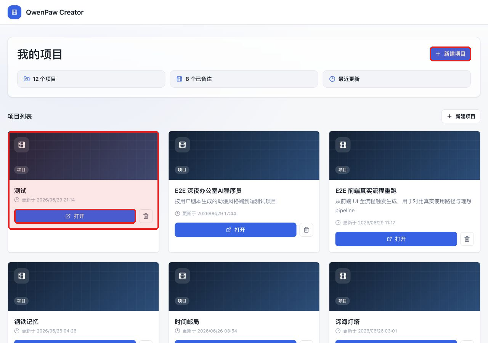
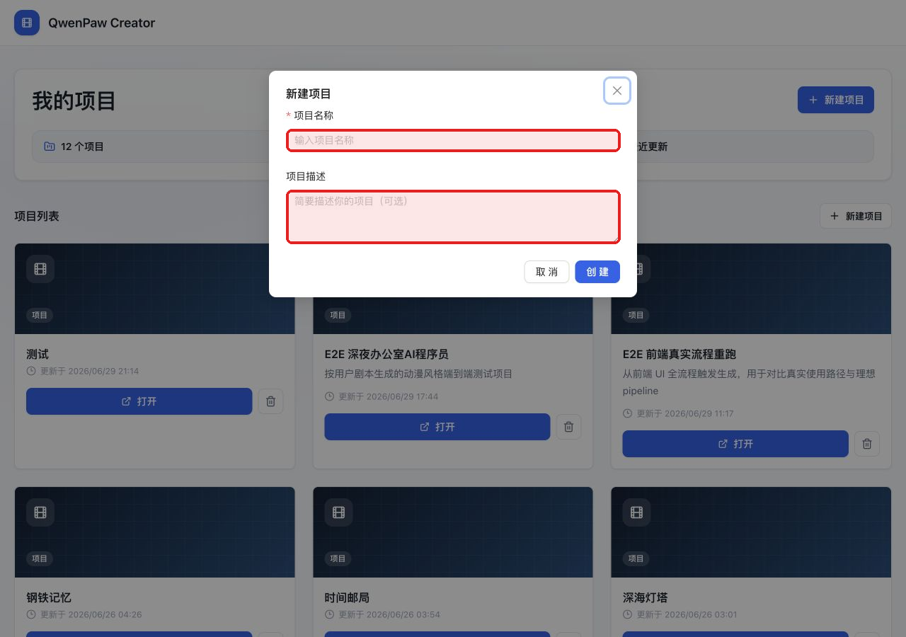
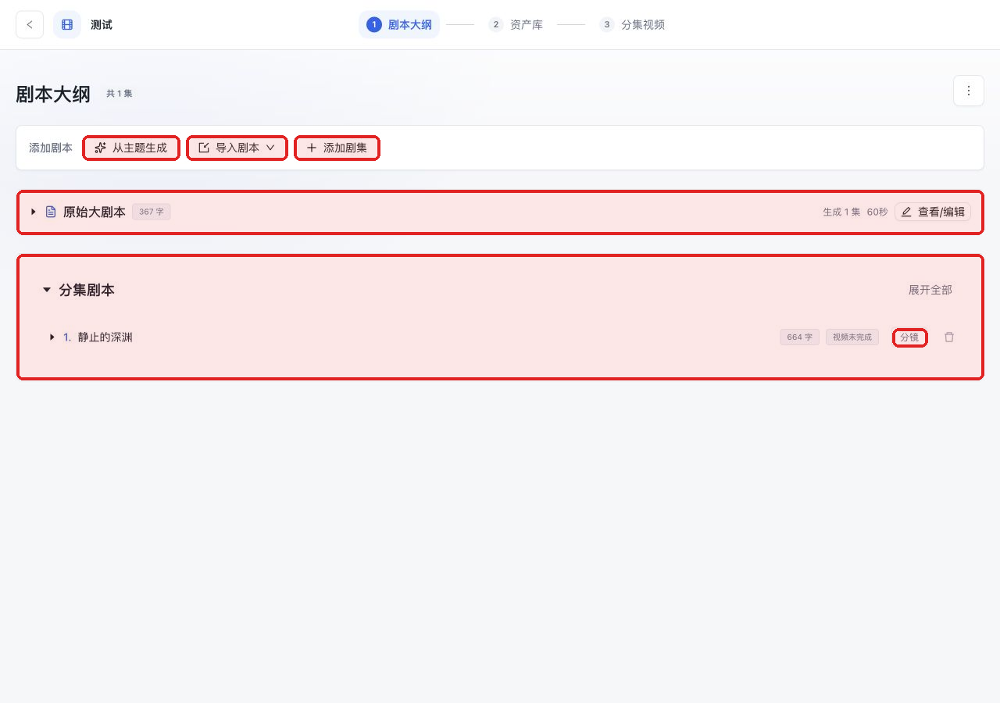
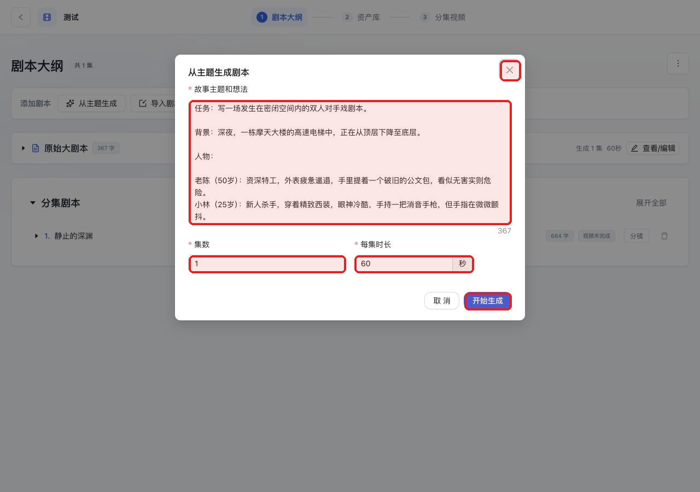
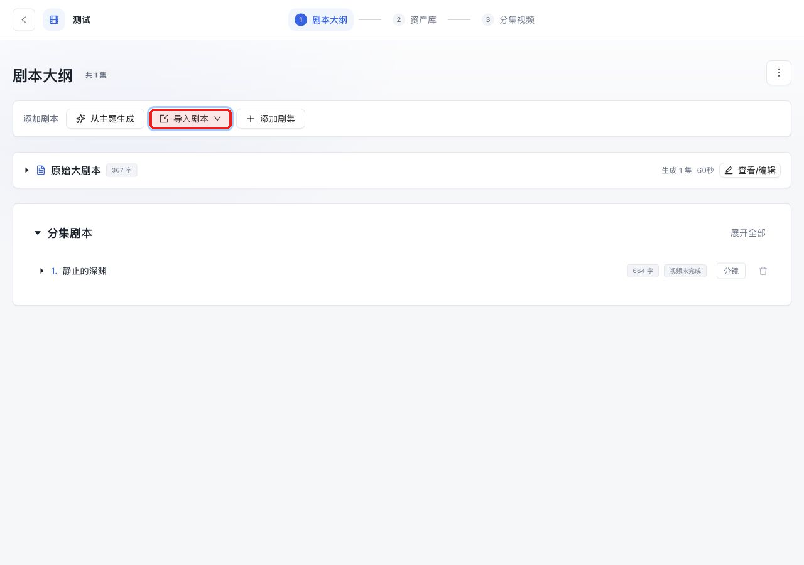
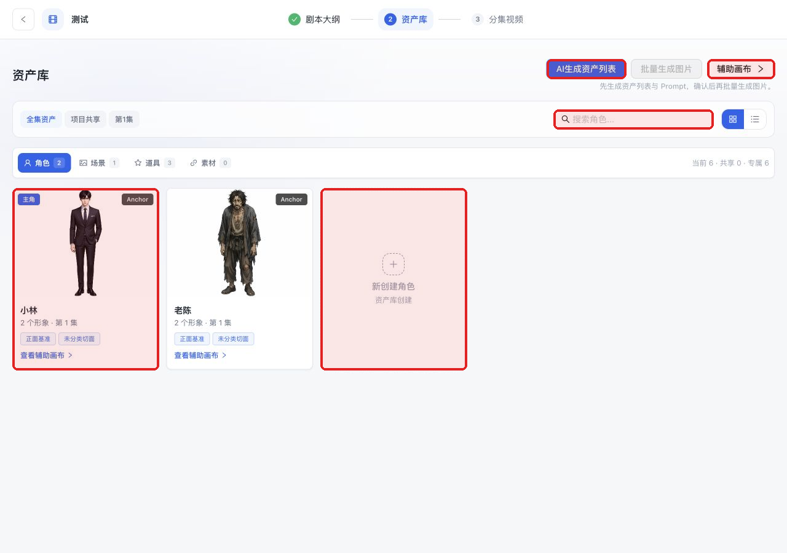
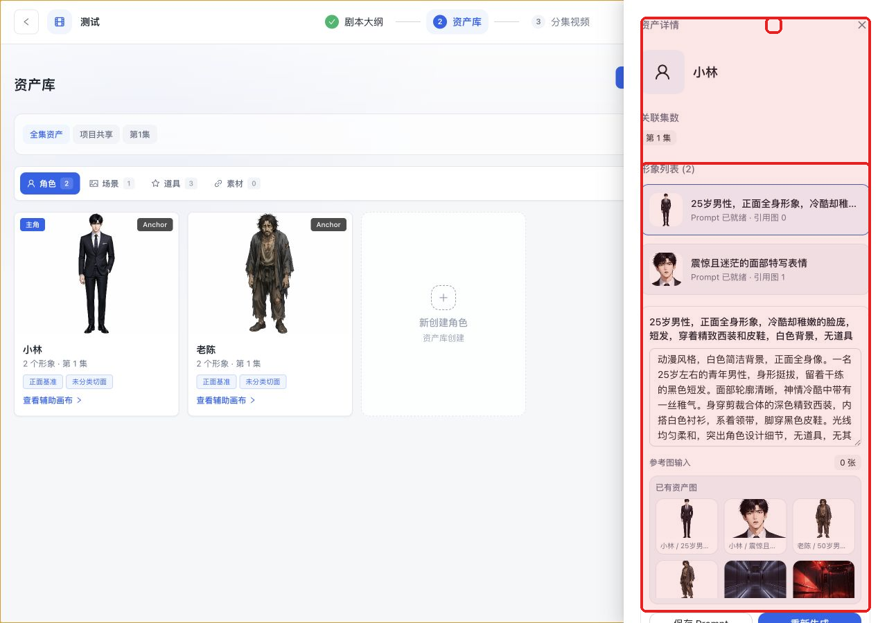
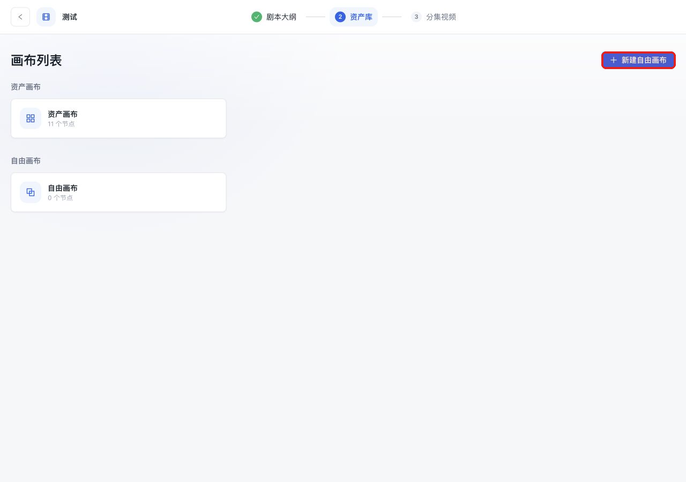
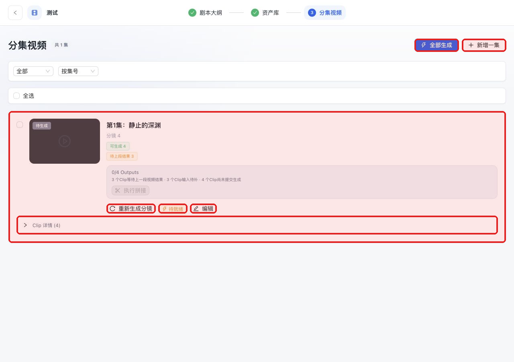
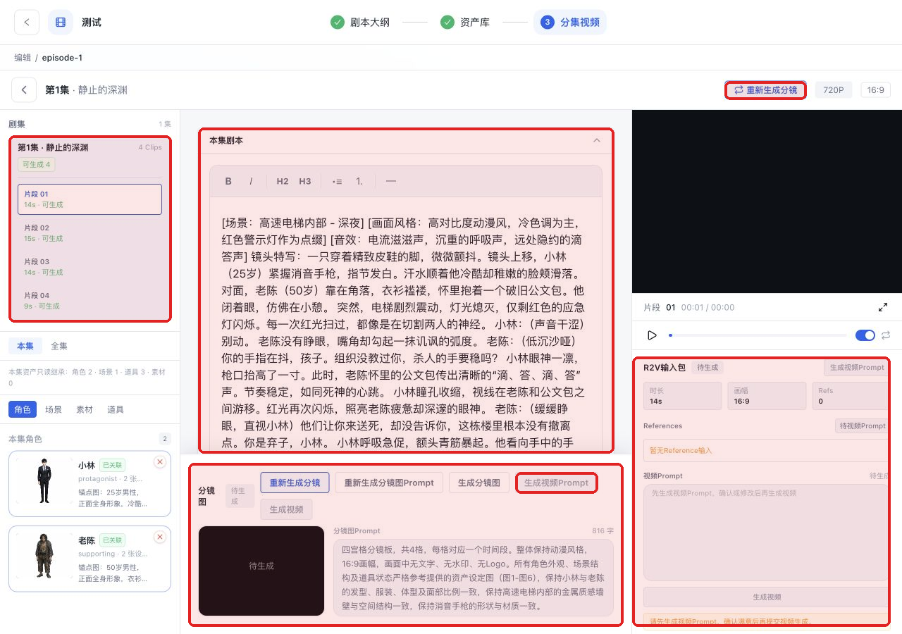

# QwenPaw Creator：从原始剧本生成完整视频教程

本教程按当前 QwenPaw 插件形态更新，并基于当前本地最新页面重新截图。目标读者是第一次使用的创作者：你只需要按步骤操作，就能从一个原始剧本走到分镜、资产、分镜图、Clip 视频和最终拼接。

> 验证说明：本次已重新启动前端以清除旧 chunk 缓存，后端 `/api/creator/health` 返回 ready；截图来自 `http://127.0.0.1:18110/creator` 当前真实页面。所有红框按页面实际控件边界复核后生成，没有触发真实视频生成任务。

## 快速流程

1. 在 `qwenpaw-creator/` 中配置 `.env`，或在 QwenPaw 的 Creator tool 配置中填写 Key。
2. 打开 `http://127.0.0.1:18110/creator`，新建项目或打开已有项目。
3. 在剧本大纲页用 **从主题生成** 或 **导入剧本** 得到分集剧本。
4. 到资产库点击 **AI生成资产列表**，确认角色、场景、道具、素材。
5. 必要时进入 **辅助画布**，补充资产切面或关系。
6. 到分集视频页点击 **重新生成分镜 / 生成分镜**。
7. 进入 **编辑**，准备分镜图和视频生成资料。
8. 点击 **生成视频**，等待任务完成。
9. 回到分集视频页，所有 Clip 完成后执行拼接。
10. 预览并导出最终视频。

> **快捷方式**：点击导航栏右侧 ✨**一键运行**，输入主题后可直接从零自动完成全流程（剧本→资产→分镜→视频→拼接），无需手动操作各页面。

## 0. 启动和检查

```bash
cd qwenpaw-creator
cp .env.example .env
# 编辑 .env，至少填写 TEXT/IMAGE/VIDEO/OSS 对应 Key，或改用 QwenPaw Tools 配置
# 启动 QwenPaw，并确保 qwenpaw-creator 已作为插件安装/软链到 QwenPaw working dir
```

常用地址：

| 地址 | 作用 |
|---|---|
| `http://127.0.0.1:18110/creator` | 前端界面 |
| `http://127.0.0.1:18110/api/creator/health` | 检查 Key、视频后端、FFmpeg |
| `qwenpaw-creator/data/projects` | 项目 JSON 数据 |
| `qwenpaw-creator/generated` | 图片、视频和拼接产物 |

<details>
<summary>执行逻辑：启动服务</summary>

QwenPaw 启动后会加载 `qwenpaw-creator/plugin.py`，注册 `/api/creator/*` 后端路由；前端由 `qwenpaw-creator/ui/dist/index.js` 注册 `APP > Creator`，并在 `/creator` 以独立 Creator 界面打开 `qwenpaw-creator/ui/dist/app/index.html`。

这一步不调用 AI。`/api/creator/health` 会检查文本、图片、视频 Key，OSS/Reference 媒体配置，以及 FFmpeg 是否可用。
</details>

## 1. 项目列表



| 按钮/区域 | 作用 | 是否可修改 |
|---|---|---|
| 新建项目 | 创建新项目 | 项目名、描述可填 |
| 项目卡片 | 显示已有项目 | 点击卡片内按钮进入 |
| 打开 | 进入剧本大纲页 | 不修改数据 |
| 删除图标 | 删除项目 | 会影响数据，谨慎使用 |



| 字段 | 作用 | 建议 |
|---|---|---|
| 项目名称 | 项目显示名称 | 用作品名或测试名 |
| 项目描述 | 项目备注 | 可写风格、目标、版本说明 |

<details>
<summary>执行逻辑：新建项目</summary>

前端提交项目名称和描述，项目保存到 `qwenpaw-creator/data/projects/{id}.json`，随后跳转到：

```text
/project/{projectId}/script
```

这一步不调用 AI。
</details>

## 2. 剧本大纲页



这里负责把原始想法或已有剧本变成分集剧本。

| 按钮/区域 | 作用 | 可修改项 |
|---|---|---|
| 从主题生成 | 打开 AI 生成剧本弹窗 | 主题、集数、每集时长 |
| 导入剧本 | 当前入口用于导入/解析已有剧本 | 原始文本或 `.txt` |
| 添加剧集 | 手动添加空白分集 | 标题、正文后续可改 |
| 原始大剧本 | 保存母稿/主题 | 可查看和编辑 |
| 分集剧本卡片 | 每集的正文和状态 | 可展开、编辑、删除 |
| 分镜 | 进入该集分镜编辑 | 修改 Clip、镜头 |

### 2.1 从主题生成



| 字段/按钮 | 作用 | 新手建议 |
|---|---|---|
| 故事主题和想法 | 输入故事母稿 | 写清人物、冲突、结尾 |
| 集数 | 生成多少集 | 初次建议 1-3 集 |
| 每集时长 | 每集目标秒数 | 短视频常用 30-90 秒 |
| 开始生成 | 调用 AI 生成分集剧本 | 生成期间不要刷新 |

<details>
<summary>执行逻辑：AI 生成剧本</summary>

接口：

```http
POST /api/ai/script
```

后端会调用文本生成能力，按主题、集数、每集时长和风格生成结构化分集结果；解析成功后写入项目，解析失败时返回阻塞原因。
</details>

### 2.2 导入已有剧本



当前页面的导入入口是 **导入剧本**。源码中下拉包含两种方式：

| 方式 | 作用 |
|---|---|
| 大剧本 AI 分集 | 把完整母稿交给 AI 拆成分集 |
| 分集剧本解析 | 粘贴/上传已分集文本，前端按规则拆分 |

<details>
<summary>执行逻辑：分集剧本解析</summary>

前端本地拆分，不调用 AI。规则来自 `ScriptImportDialog`：

- 优先识别 `第1集`、`第一集` 这类标题。
- 如果没有集号，则按空行拆分。
- 如果只有一段，则导入为 1 集。
</details>

## 3. Pipeline 一键运行

导航栏右侧有 ✨**一键运行** 按钮，点击后从右侧滑出 Agent 面板。

### 3.1 从主题开始

如果项目还没有剧本，可以在面板顶部的文本框输入创作主题，然后点击 **从主题开始**：

1. 后端先根据主题生成分集剧本
2. 自动进入 Pipeline 全流程：风格定义 → 资产规划 → 资产生成 → 分镜规划 → 故事板 → 视频生成 → 拼接 → 评估
3. 每一步完成后会自动同步到项目 JSON，刷新页面或另开 tab 都能看到最新结果

### 3.2 基于已有剧本运行

如果项目已有剧本，留空输入框直接点击 **开始运行**：

- Pipeline 会跳过所有中间检查点，自动执行全部 10 个步骤
- 面板以 Agent 对话的形式逐条显示当前执行的步骤
- 运行期间请勿关闭此窗口

<details>
<summary>执行逻辑：Pipeline 编排</summary>

接口：

```http
POST /api/pipeline/create
POST /api/pipeline/{id}/run-all
GET /api/pipeline/{id}
```

Pipeline 按 `STEP_ORDER` 顺序推进：

```
episode_split → style_guide_gen → asset_planning → asset_prompt_gen
→ asset_image_gen → clip_planning → storyboard_image_gen → video_gen
→ stitching → evaluation
```

其中前 8 步为检查点（checkpoint），`run-all` 模式会自动 approve 并继续下一步。
每步完成后结果会同步写入 `qwenpaw-creator/data/projects/{id}.json`，前端可实时看到变化。
</details>

## 4. 资产库



| 按钮/区域 | 作用 | 可修改项 |
|---|---|---|
| AI生成资产列表 | 从剧本规划角色、场景、道具、素材 | 依赖分集剧本和项目风格 |
| 辅助画布 | 进入画布查看/补充资产关系 | 可补切面、节点、参考图 |
| 搜索框 | 按名称查找资产 | 输入关键词 |
| 角色卡片 | 查看角色锚点图和切面 | 可打开详情、编辑描述 |
| 新建角色卡片 | 手动创建角色 | 名称、描述 |



| 区域 | 作用 |
|---|---|
| 资产详情抽屉 | 查看当前资产的名称、类型、关联集数 |
| 形象列表 | 显示锚点图、衍生图和生成结果 |
| 关闭 | 退出详情抽屉 |

<details>
<summary>执行逻辑：AI 生成资产列表</summary>

接口：

```http
POST /api/ai/assets/from-script
```

执行链路：

1. `asset_planning_agent` 读取所有分集剧本，输出需要的角色、环境、道具。
2. 系统为每个资产的锚点图/衍生图生成图片描述。
3. 如果 `generate_images=true`，后端最多为每个资产生成 2 张参考图。

这一步只需要用户确认资产列表和图片结果，不需要手动理解内部文本生成细节。
</details>

## 5. 画布（可选但推荐）



| 按钮/区域 | 作用 |
|---|---|
| 新建自由画布 | 手动创建一个空白画布 |
| 资产画布/自由画布 | 打开已有画布，组织资产节点 |

画布用于检查资产之间的关系，补充角色切面、场景变体、道具、图片节点等。当前插件流程把它放在资产生成的手动补充流程里，而不是必须步骤。

## 6. 分集视频页



| 按钮/区域 | 作用 | 什么时候用 |
|---|---|---|
| 全部生成 | 批量推进当前可执行任务 | 已确认资产和分镜后 |
| 新增一集 | 手动添加分集视频条目 | 缺少集数时 |
| 分集视频卡片 | 显示该集 Clip、输出和状态 | 检查生成进度 |
| 重新生成分镜 / 生成分镜 | 为该集重新拆 Clip | 剧本修改后 |
| 待就绪 | 当前还有依赖未满足 | 需要先补资产或参考图 |
| 编辑 | 进入分镜编辑页 | 精修 Clip 和生成视频 |
| Clip 详情 | 展开该集所有 Clip 状态 | 查看哪段缺图/缺视频 |

<details>
<summary>执行逻辑：生成分镜</summary>

接口：

```http
POST /api/ai/storyboard
```

后端会根据单集剧本、画幅、目标时长、角色、场景和风格生成结构化分镜，并归一化结果，确保单个 R2V Clip 不超过 15 秒。
</details>

## 7. 分镜编辑页：生成分镜图和视频



| 区域/按钮 | 作用 | 可修改项 |
|---|---|---|
| 片段列表 | 选择 Clip，查看可生成状态 | 可切换 Clip |
| 本集剧本编辑器 | 修改该集剧本正文 | 场景、动作、对白、节奏 |
| 分镜图区域 | 当前 Clip 的分镜参考图 | 可重新生成 |
| R2V 输入包 | 视频生成所需资料 | 时长、画幅、参考资源 |
| 重新生成分镜 | 重拆当前集的 Clip | 剧本变化后使用 |
| 生成视频准备 | 根据 Clip 资料整理视频生成内容 | 生成前可人工检查 |
| 生成视频 | 提交异步视频任务 | 会消耗视频生成额度 |

推荐顺序：

1. 检查左侧资产是否已关联。
2. 检查本集剧本和当前 Clip 是否合理。
3. 点击生成分镜图相关按钮。
4. 点击 **生成分镜图**。
5. 点击生成视频准备相关按钮。
6. 检查生成内容，不满意可改剧本/分镜后重来。
7. 点击 **生成视频**。
8. 回分集视频页查询状态和拼接。

<details>
<summary>执行逻辑：分镜图</summary>

生成分镜图接口：

```http
POST /api/ai/storyboard-image
```

后端会先整理当前 Clip 的分镜图生成资料，再调用图片模型生成可作为 R2V 参考的 storyboard sheet。
</details>

<details>
<summary>执行逻辑：R2V 提交</summary>

前端会先整理当前 Clip 的结构化上下文：

- 项目风格、画幅
- 当前集标题
- 当前 Clip 编号、时长、story_text
- 角色、场景、道具、素材
- 分镜图 reference 绑定
- shots、camera、dialogue

视频提交接口：

```http
POST /api/ai/video
```

生成视频会提交异步任务，返回 `task_id`；之后通过：

```http
GET /api/ai/video/{task_id}
```

查询状态并回填结果 URL。系统会在提交前整理当前 Clip 的视频生成资料，并补齐必要的稳定性约束。
</details>

## 8. 拼接和导出

当某一集所有 Clip 都生成成功后，回到分集视频页执行拼接。

| 操作 | 背后逻辑 |
|---|---|
| 构建拼接计划 | `POST /api/video/stitch-plan` 检查每个 Clip 是否有结果 |
| 执行拼接 | `POST /api/video/stitch-execute` 调用 FFmpeg 拼接 |
| 预览 | 播放拼接后的整集视频 |
| 导出/下载 | 下载 `qwenpaw-creator/generated` 中的最终文件 |

<details>
<summary>执行逻辑：为什么拼接可能不可用</summary>

拼接前会检查：

- 是否还有 Clip 生成任务未完成。
- 是否有 Clip 没有 `result_url`。
- 是否有视频结果文件无法访问。
- FFmpeg 是否可用。

如果任意条件不满足，页面会显示待就绪或阻塞原因。
</details>

## 9. 最容易改、也最值得改的内容

| 阶段 | 推荐修改 |
|---|---|
| 生成剧本前 | 主题、风格、目标时长、人物关系 |
| 分集剧本后 | 每集标题、对白、场景、动作 |
| 资产库 | 角色外观、场景设定、道具描述、参考图 |
| 分镜编辑 | Clip 时长、shot 描述、action_timeline |
| 视频生成前 | 分镜图、参考资源、视频生成内容 |
| 拼接前 | 失败 Clip、过长 Clip、画面不连续 Clip |
